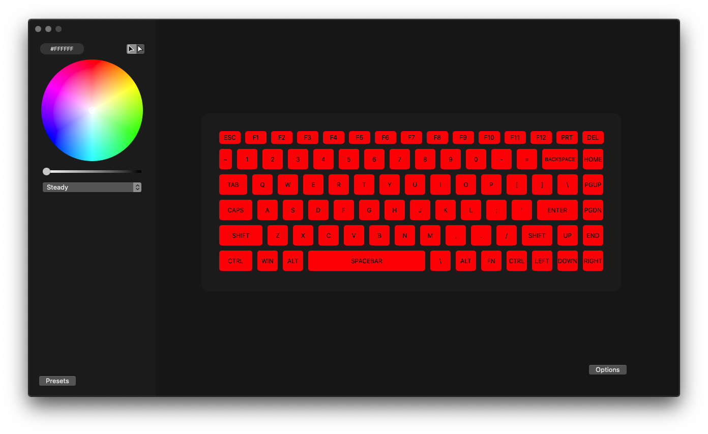
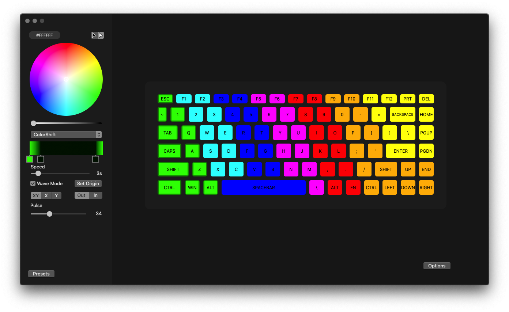
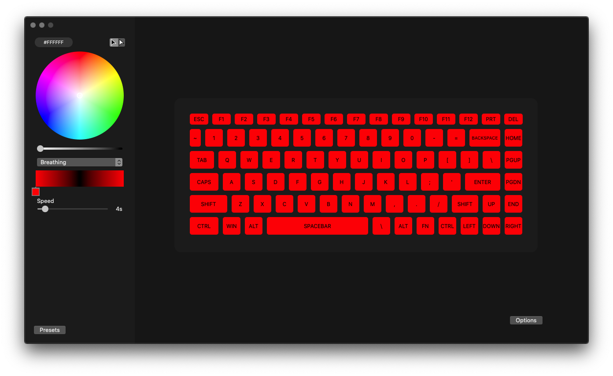
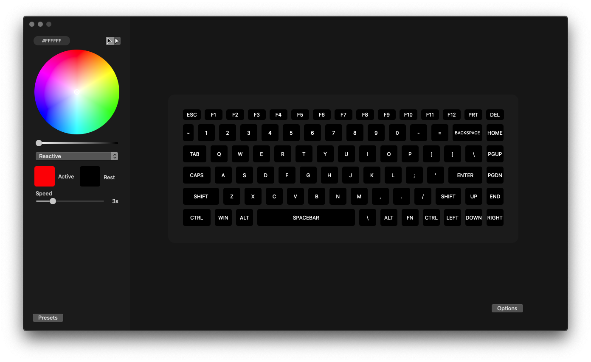
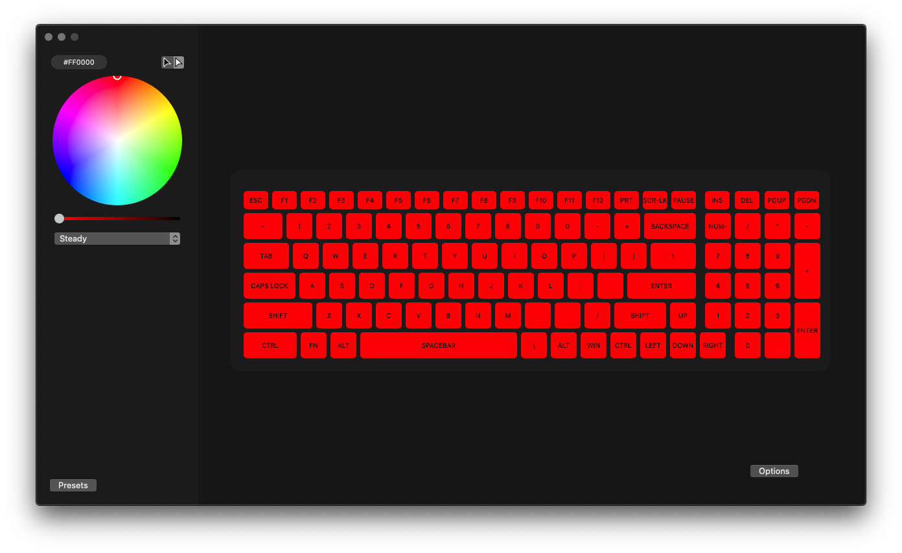
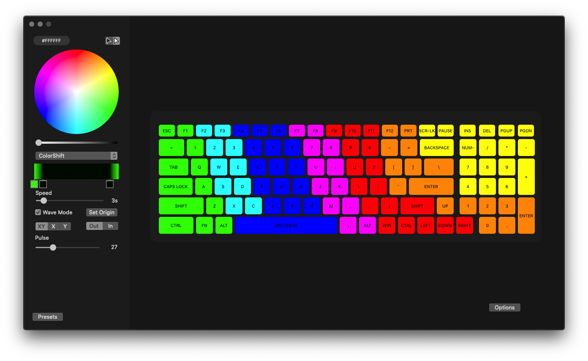
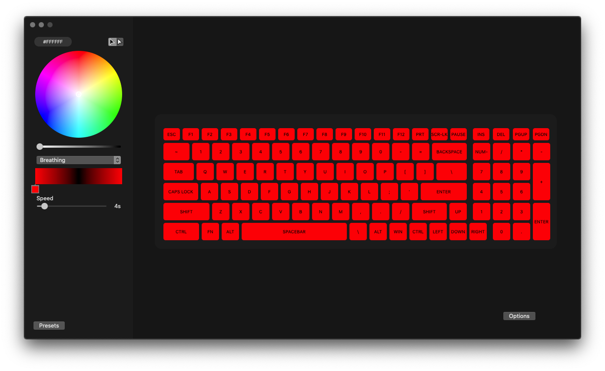
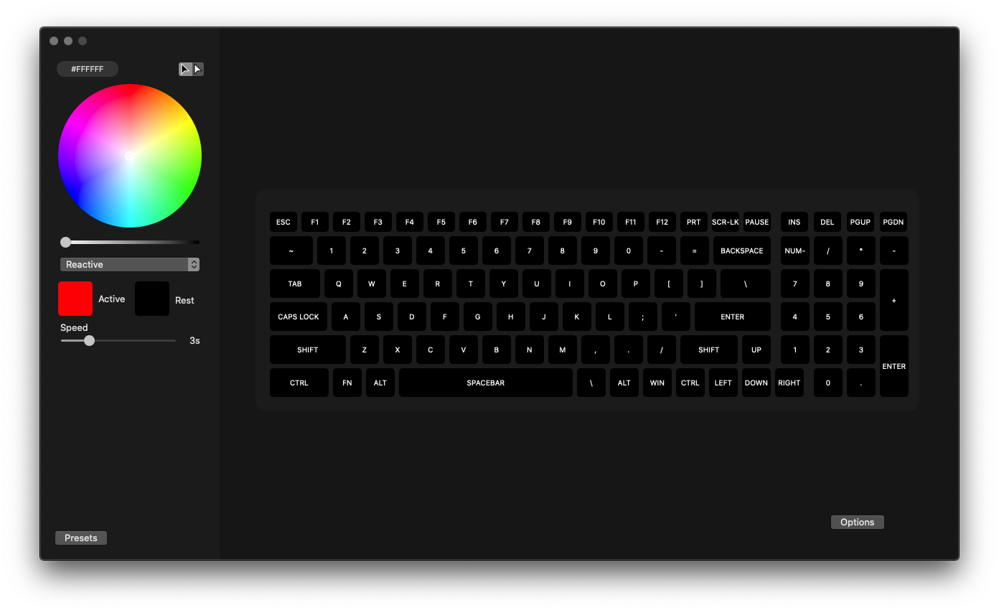
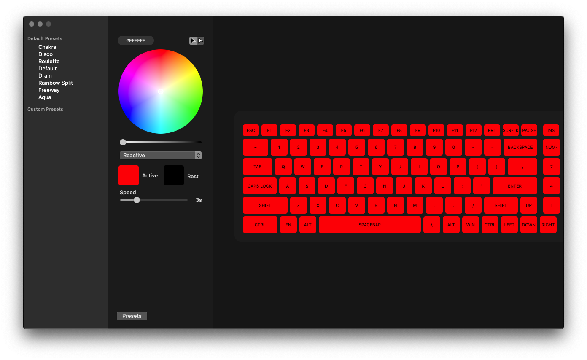

![alt text][logo] 

[logo]: images/keyboard-hue-dark-128.png "SSKeyboardHue Logo"

# SSKeyboardHue

The purpose of this repository is to control Per-Key RGB Keyboard on an MSI Laptop running macOS using a native app. This is the wrapper of [SSKeyboard](https://github.com/ErrorErrorError/SSKeyboard), which is the brains of communicating with the keyboard.
<br>
<br> 
This app is still in development.

# Goal
The goal is to support all MSI Laptop keyboards that have RGB.
<br>
***Currently only the individual per key keyboard RGB is supported.***
# Supported Models
*   MSI GS65
*   MSI GE63 Raider RGB

<br>***Should support all other per-key rgb keyboard but It's been only tested on these models.***

### Features: PerKey
*   Steady
*   Reactive
*   ColorShift
*   Breathing
*   Disabled
*   Saving custom presets

### Features: Three Region
*   Coming soon...
# Download/Build
### Download:
Download the latest release [here](https://github.com/ErrorErrorError/SSKeyboardHue/releases).
### Build: 
Run on terminal:
```
git clone --recursive https://github.com/ErrorErrorError/SSKeyboardHue.git
```
Make sure you use ```.xcworkspace``` file if you're planning to run the app from xcode.

# Screenshots
### GS65 Model









### PerKey Model











# Open Source Libraries
* [FileWatcher](https://github.com/eonist/FileWatcher)
* [ColorPicker](https://github.com/Gofake1/Color-Picker)

# Contributors
[@skyline75489](https://github.com/skyline75489) for providing his debug files for GE63 Raider RGB. <br>
[@Askannz](https://github.com/Askannz/) for his documentation of keycodes - [msi-perkeyrgb](https://github.com/Askannz/msi-perkeyrgb). <br>
[@stevelacy](https://github.com/stevelacy) for his inspiration to design a gui to control color keyboard - [msi-keyboard-gui](https://github.com/Askannz/msi-perkeyrgb). <br>
[@TauAkiou](https://github.com/TauAkiou) for providing his doumentation on key effects.